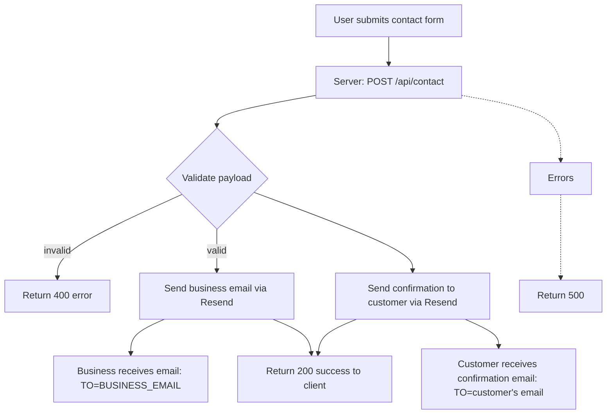

## Email configuration for Resend

This document explains which email addresses to use with Resend in the contact form flow and why. It includes a simple Mermaid workflow for the runtime flow and a table comparing the possible "from"/"to" addresses you mentioned.

### Quick summary

- Use a Resend-managed address (like `bestitconsulting@resend.dev`) as the `FROM` while your domain is not yet verified in Resend.
- After verifying `bestitconsulting.ca` in Resend (SPF/DKIM/TXT), switch to a domain address such as `service@bestitconsulting.ca` and set that in `FROM_EMAIL`.
- `BUSINESS_EMAIL` can be any inbox you own (e.g. `williamjxj@gmail.com`) that will receive contact submissions.

### Mermaid workflow



### Addresses comparison (table)

| Address / Pattern                                                                   |                    Use case in code |                                             Requires domain verification? |    Recommended now? | Notes                                                                                                                |
| ----------------------------------------------------------------------------------- | ----------------------------------: | ------------------------------------------------------------------------: | ------------------: | -------------------------------------------------------------------------------------------------------------------- |
| `service@bestitconsulting.ca` or `Best IT Consulting <service@bestitconsulting.ca>` |                       FROM (sender) | Yes — you must verify `bestitconsulting.ca` in Resend and add DNS records | No (until verified) | Use this after verifying DKIM/SPF in Resend for best deliverability and branding. Set `FROM_EMAIL` to this value.    |
| `bestitconsulting@resend.dev` or similar (Resend-managed)                           |                       FROM (sender) |                                    No — works without domain verification |     Yes (temporary) | Use while verifying your domain; Resend provides `@resend.dev` addresses you can use immediately.                    |
| `williamjxj@gmail.com`                                                              |             BUSINESS recipient (TO) |                                                                        No |                 Yes | Any email can be the recipient. Keep this private or set it via `BUSINESS_EMAIL` env var.                            |
| `user-submitted@example.com`                                                        | Customer recipient (TO) — from form |                                                                        No |                 Yes | This is the customer's email from the form. Use as the `to` for confirmation and as `replyTo` on the business email. |

### What the code expects (env variables)

- `RESEND_API_KEY` — required. Your Resend API key.
- `FROM_EMAIL` — optional; default currently set to `Best IT Consulting <bestitconsulting@resend.dev>` in code. Set to `Best IT Consulting <service@bestitconsulting.ca>` after verification.
- `BUSINESS_EMAIL` — optional; default currently `williamjxj@gmail.com` in code. Set to your business inbox if different.

Example `.env.local` snippet (for local development):

```env
RESEND_API_KEY=key_live_xxx
FROM_EMAIL="Best IT Consulting <bestitconsulting@resend.dev>"
BUSINESS_EMAIL=williamjxj@gmail.com
```

### Domain verification checklist (Resend)

1. Login to Resend dashboard → Domains → Add `bestitconsulting.ca`.
2. Resend will show DNS records (TXT for verification, DKIM CNAMEs). Add them to your DNS provider.
3. Wait for DNS propagation and Resend to confirm verification. This can take minutes to hours.
4. Once verified, update `FROM_EMAIL` to `Best IT Consulting <service@bestitconsulting.ca>` and restart your app if necessary.

Notes on SPF/DKIM/DMARC:

- Resend will provide DKIM records to sign your messages. Add them exactly as given.
- You may optionally add an SPF include for Resend (e.g. `include:resend.net`) — follow Resend docs.
- Consider a DMARC policy for the domain after testing.

### Reply-To behavior

Set `replyTo` to the customer's email (the email submitted in the form). This lets you click "Reply" in your inbox and respond directly to the user. The `FROM` address must still be a verified/resend-managed address.

### Testing recommendations

1. Use `bestitconsulting@resend.dev` as `FROM_EMAIL` and send several test messages to `BUSINESS_EMAIL` to confirm receipt.
2. Test with a real customer email you control to confirm the confirmation email arrives and the reply-to is set correctly.
3. After domain verification, switch `FROM_EMAIL` to `service@bestitconsulting.ca` and repeat tests.

---

File location: `docs/email-config.md` — keep this updated when you change the env names or default values in `app/api/contact/route.ts`.
